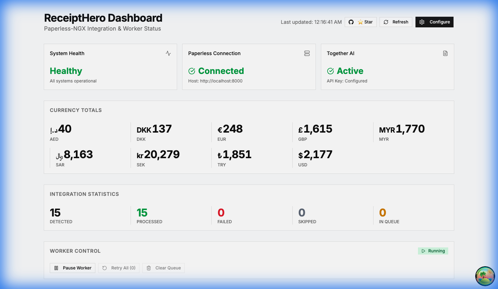
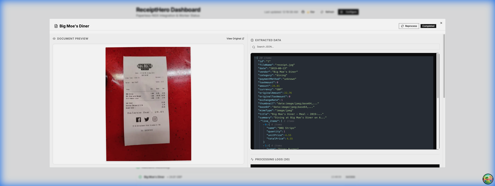
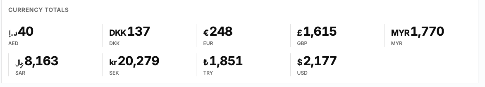
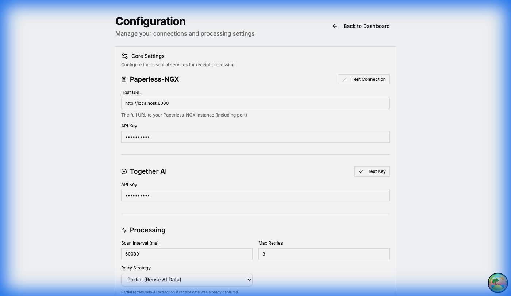

# 🧾 ReceiptHero

[](https://github.com/smashah/receipthero-ng)
[](LICENSE)
[](docker-compose.yml)

---

**ReceiptHero** is an AI-powered receipt management companion for [Paperless-ngx](https://github.com/paperless-ngx/paperless-ngx) that automatically extracts, organizes, and converts your receipts using advanced vision AI.

It transforms your chaotic receipt archive into a **searchable, structured database** with automatic vendor detection, item extraction, and **multi-currency conversion** — all through a beautiful real-time dashboard.

> 💡 Just upload a receipt and let AI do the rest:
> - Vendor name, date, and total amount extracted automatically
> - Line items parsed with individual prices
> - Currency converted to your preferred currencies
> - Paperless-ngx updated with structured metadata

Powered by **Together AI's Llama 4 Maverick** vision model for accurate receipt parsing.

---

## 🎬 See It In Action

[](docs/tutorial.mp4)

> 👆 **Click to watch the tutorial video**

---

## ✨ Features

### 🤖 AI-Powered Receipt Extraction
- Automatic OCR using Together AI's Llama 4 Maverick vision model
- Extracts vendor, amount, currency, date, payment method
- Parses individual line items with prices
- Handles receipts in any language
- Smart retry with exponential backoff for reliability

<!-- TODO: Add screenshot of processed receipt in Paperless -->


### 💱 Automatic Currency Conversion
- Convert receipt amounts to multiple target currencies
- Uses fawazahmed0 exchange-api with dual CDN fallback
- Weekly average exchange rates for accuracy
- Source currency always preserved alongside conversions
- Configure your preferred currencies (GBP, USD, EUR, SAR, etc.)

<!-- TODO: Add screenshot of currency totals card -->


### 📊 Real-Time Dashboard
- **System Health**: Live status of all integrations
- **Currency Totals**: Aggregated spending in all your currencies
- **Integration Stats**: Documents detected, processed, failed, queued
- **Worker Control**: Pause, resume, retry all, clear queue
- **Live Logs**: Real-time processing updates via WebSocket

<!-- TODO: Add dashboard screenshot -->


### ⚙️ Easy Configuration
- Web-based settings page for all options
- Test connections before saving
- Dynamic currency list from live exchange rates
- No config files needed (but supported)

<!-- TODO: Add settings page screenshot -->


### 🔗 Seamless Paperless-ngx Integration
- Automatic document title: `{Vendor} - {Amount} {Currency}`
- Creates correspondents for vendors
- Applies category tags automatically
- Stores full receipt JSON in custom fields
- Tags processed/failed documents for tracking

---

## 🚀 Quick Start

### Docker (Recommended)

**Option A: Clone the repo**

```bash
git clone https://github.com/smashah/receipthero-ng.git
cd receipthero-ng
docker compose up -d
open http://localhost:3000
```

**Option B: Deploy from pre-built image (fastest)**

```bash
# Create the directory structure in your services folder
mkdir -p ~/services/receipthero/data

# Create a minimal config file
cat > ~/services/receipthero/data/config.json << 'EOF'
{
  "paperless": {
    "host": "http://YOUR_PAPERLESS_IP:8000",
    "apiKey": "YOUR_PAPERLESS_API_KEY"
  }
}
EOF

# Create docker-compose.yaml
cat > ~/services/receipthero/docker-compose.yaml << 'EOF'
services:
  receipthero:
    image: ghcr.io/smashah/receipthero-ng:latest
    environment:
      - DATABASE_PATH=/app/data/receipthero.db
      - CONFIG_PATH=/app/data/config.json
      - BUN_DEV_SERVER_PORT=3099
    volumes:
      - ./data:/app/data
    ports:
      - "3000:3000" #Change the first number because most likely the 3000 port is already taken on your machine!
    restart: unless-stopped
EOF

# Start the container
cd ~/services/receipthero
docker compose up -d

# Open the dashboard
open http://localhost:3000
```

> 📁 **Directory Structure:**
> ```
> ~/services/receipthero/
> ├── docker-compose.yaml
> └── data/
>     ├── config.json          # Your configuration
>     └── receipthero.db       # Created automatically
> ```

### First-Time Setup

1. Open the webapp at `http://localhost:3000`
2. Click **Configure** to open settings
3. Enter your Paperless-ngx host and API key
4. Enter your Together AI API key
5. (Optional) Enable currency conversion and select target currencies
6. Click **Save** and you're ready!

> 💡 **Tip**: Click "Test Connection" buttons to verify your setup before saving.

---

## 🐳 Docker Support

- Health monitoring with auto-restart
- Persistent SQLite database
- Graceful shutdown handling
- Single container for API + Worker + Webapp
- Works out of the box with minimal configuration

---

## 💱 Currency Conversion

Enable automatic conversion to track spending in your preferred currencies:

```json
{
  "processing": {
    "currencyConversion": {
      "enabled": true,
      "targetCurrencies": ["GBP", "USD", "SAR"]
    }
  }
}
```

Your receipts will include converted amounts:

```json
{
  "amount": 10,
  "currency": "AED",
  "conversions": {
    "AED": 10.00,
    "GBP": 2.15,
    "USD": 2.72,
    "SAR": 10.22
  }
}
```

The dashboard displays aggregated totals for each currency, giving you instant visibility into your spending across currencies.

---

## 📁 Document Type Detection

By default, ReceiptHero looks for documents tagged with `receipt`. If you already have document types set up in Paperless-ngx, you can detect receipts by `document_type` instead:

```json
{
  "processing": {
    "useDocumentType": true,
    "documentTypeName": "receipt"
  }
}
```

When enabled:
- Documents with `document_type = "receipt"` are automatically processed
- No need to manually tag receipts
- Works with your existing Paperless-ngx document type workflow

---

## 🧭 Roadmap

- [x] AI-powered receipt extraction
- [x] Multi-currency conversion
- [x] Real-time dashboard with live logs
- [x] Worker pause/resume controls
- [x] Web-based configuration
- [x] Document type detection (alternative to tag-based)
- [ ] Receipt analytics and charts
- [ ] Monthly/weekly spending reports
- [ ] Export to CSV/Excel
- [ ] Mobile-responsive design improvements
- [ ] Batch reprocessing of old receipts

---

## 🔧 Development

### Local Setup

```bash
# Install dependencies
pnpm install

# Start all services (API + Worker + Webapp)
pnpm run dev

# API: http://localhost:3001
# Webapp: http://localhost:3000
```

### Commands

```bash
pnpm run dev        # Start development servers
pnpm run build      # Build for production
pnpm run test       # Run tests
pnpm turbo typecheck # Type check all packages
```

### Architecture

This is a Turborepo monorepo:

| Package | Description |
|---------|-------------|
| `@sm-rn/api` | Hono API backend (Bun runtime) |
| `@sm-rn/webapp` | TanStack Start frontend |
| `@sm-rn/worker` | Background processing worker |
| `@sm-rn/core` | Core services (Paperless, OCR, currency, logging) |
| `@sm-rn/shared` | Shared types and schemas |

### Tech Stack

**Backend:** Hono, Bun, Drizzle ORM, SQLite, Together AI  
**Frontend:** React 19, TanStack Start/Router, TypeScript  
**Infrastructure:** Turborepo, pnpm, Docker

---

## 📖 API Reference

<details>
<summary>Click to expand API endpoints</summary>

### Health & Configuration
- `GET /api/health` - Health check with stats
- `GET /api/config` - Get configuration (masked keys)
- `POST /api/config` - Save configuration
- `GET /api/config/currencies` - Get available currencies
- `POST /api/config/test-paperless` - Test Paperless connection
- `POST /api/config/test-together` - Test Together AI key

### Processing
- `POST /api/ocr` - Extract receipt data from image
- `GET /api/processing/logs` - Get processing logs
- `GET /api/processing/logs/:documentId` - Get document-specific logs

### Worker Control
- `GET /api/worker/status` - Get worker status
- `POST /api/worker/pause` - Pause worker
- `POST /api/worker/resume` - Resume worker
- `POST /api/worker/trigger-scan` - Trigger immediate scan

### Queue Management
- `GET /api/queue/status` - Get queue status
- `POST /api/queue/retry-all` - Retry all failed items
- `POST /api/queue/clear` - Clear the queue

### Statistics
- `GET /api/stats/currency-totals` - Get aggregated currency totals

</details>

---

## 🤝 Contributing

Contributions are welcome! Feel free to open issues or submit PRs.

```bash
# Fork, clone, then:
git checkout -b feature/YourFeature
# After changes:
git commit -m "Add YourFeature"
git push origin feature/YourFeature
```

---

## 📄 License

This project is licensed under the MIT License. See [LICENSE](LICENSE) for details.

---

## 🙏 Support

If ReceiptHero helps you manage your receipts, consider:
- ⭐ Starring the repository
- 🐛 Reporting bugs and suggesting features
- 🤝 Contributing code or documentation

---

<p align="center">
  Made with ❤️ for the Paperless-ngx community
</p>
